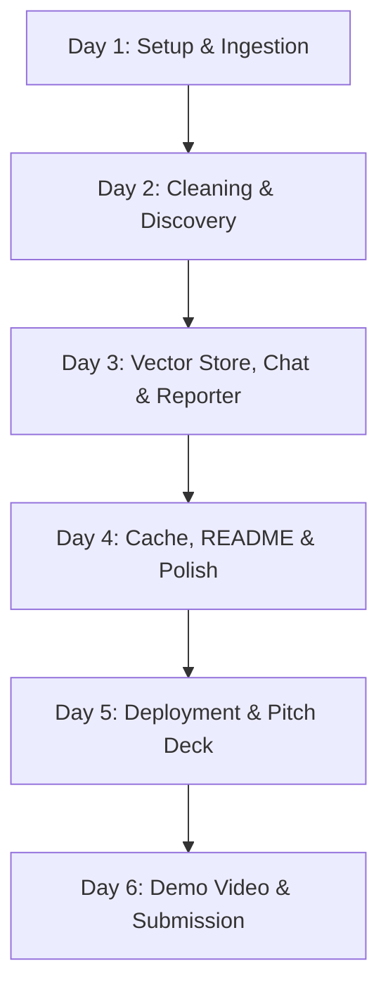

# Meshloop - Agentic Dark Data Intelligence Platform
## Developer Agent Guidelines & 6-Day Build Plan

This file provides context and instructions for AI agents working on **Meshloop**. Use this as a source of truth for implementation details, architecture, and coding rules.

---

## 🛠️ Architecture & Developer Guidelines

### 1. Technology Stack Compliance
All implementations must align with the hackathon rules requiring the **Microsoft AI stack**:
*   **LLM API**: GitHub Models endpoint (`https://models.github.ai/inference`) using `gpt-4o` for high-complexity tasks (insights discovery, conversational querying) and `microsoft/phi-4` for simple/cheap tasks (summarization, follow-up generation).
*   **Embeddings**: `text-embedding-3-small` via GitHub Models API.
*   **Orchestration**: Semantic Kernel (Python SDK) imports must be present in agent files.
*   **Token Optimization**: Since GitHub Models has strict rate limits (50 requests/day for GPT-4o), a local cache must be used in `utils/llm.py` for all completions.

### 2. File Organization
The workspace structure must be organized as follows:
```
meshloop/
├── agents/
│   ├── __init__.py
│   ├── ingestion.py      ← Parses files into standardized dicts
│   ├── cleaning.py       ← Data cleaning & type normalization
│   ├── discovery.py      ← Statistical checks + LLM-based insights
│   ├── chat.py           ← Multi-turn Q&A using vector context
│   └── reporter.py       ← Markdown reports + chart configurations
├── utils/
│   ├── __init__.py
│   ├── llm.py            ← GitHub Models connection + local cache
│   └── vector_store.py   ← In-memory ChromaDB vector store
├── sample_data/          ← Test datasets (CSV, PDF, JSON, TXT)
├── app.py                ← Streamlit UI (Priya's frontend)
├── pipeline.py           ← Master orchestrator (chains agents)
├── requirements.txt      ← Core Python dependencies
├── .env                  ← Local environment secrets (GITHUB_TOKEN)
├── .gitignore            ← Ignore cache, database, and env files
└── agent.md              ← This instruction & build plan file
```

### 3. Coding Guidelines
*   **API Calls**: Never instantiate the `OpenAI` client directly in agent code. Always use `utils.llm.call_llm()`, `utils.llm.call_llm_json()`, or `utils.llm.get_embedding()`.
*   **Type Hinting**: All python functions must use type hinting for input parameters and return values.
*   **Tabular Data**: Keep raw `pd.DataFrame` structures within intermediate steps but serialize text-friendly previews and metrics for LLM context.
*   **Error Handling**: Wrap external library calls (e.g. `fitz` for PDF parsing, `json.load`, `pd.read_excel`) in robust try-except blocks and fall back gracefully.

---

## 📅 Refined 6-Day Build Plan



### Day 1: Setup, GitHub Models & Ingestion (Manas - Backend)
*   **M1.1 — Folder Structure**: Create the directories `agents/`, `utils/`, `sample_data/` and all empty python stubs.
*   **M1.2 — Configuration**:
    *   Create `requirements.txt` containing dependencies (`streamlit`, `semantic-kernel`, `openai`, `pandas`, `numpy`, `PyMuPDF`, `python-dotenv`, `chromadb`, `plotly`, `openpyxl`, `python-multipart`).
    *   Create `.gitignore` to prevent committing `.env` and `__pycache__`.
    *   Create `test_connection.py` to verify GITHUB_TOKEN connectivity to `https://models.github.ai/inference`.
*   **M1.3 — LLM Utility (`utils/llm.py`)**:
    *   Instantiate `OpenAI` client configured with GitHub Models endpoint.
    *   Implement `call_llm(prompt, fast, temperature)` with rate limit retries (fallback to `microsoft/phi-4` if `gpt-4o` rate limits).
    *   Implement `call_llm_json(prompt)` to return parsed JSON objects.
    *   Implement `get_embedding(text)` using `text-embedding-3-small` (truncate text to 8000 characters).
*   **M1.4 — Ingestion Agent (`agents/ingestion.py`)**:
    *   Implement `ingest_file(file_path)` supporting `.csv`, `.xlsx`, `.xls`, `.pdf`, `.json`, `.txt`, `.md`.
    *   Returns dictionary with: `raw_text`, `dataframe` (or None), `file_type`, `row_count`, `column_names`, `sample_rows` (first 5 rows), and `metadata`.

### Day 2: Semantic Kernel, Cleaning & Discovery (Manas - Backend)
*   **M2.1 — Semantic Kernel Setup (`utils/sk_kernel.py`)**:
    *   Configure Semantic Kernel instance with `OpenAIChatCompletion` overriding base URL to GitHub Models inference endpoint.
*   **M2.2 — Cleaning Agent (`agents/cleaning.py`)**:
    *   Implement `clean_data(ingestion_result)`.
    *   Tabular: strip string whitespace, auto-detect datetime columns, parse numeric strings (remove currency symbols/commas), handle missing values (drop if >60% missing, median fill for numeric, mode fill for categories), remove duplicates.
    *   Unstructured: clean whitespace and duplicate carriage returns.
*   **M2.3 — Pattern Discovery Agent (`agents/discovery.py`)**:
    *   Implement `discover_patterns(cleaned_result, ingestion_result)`.
    *   Perform statistical checks (IQR outliers, strong correlations $r > 0.7$, category dominance >60%, time-series trends >20% change).
    *   Ask GPT-4o to analyze data profile and find 2-3 business insights.

### Day 3: Vector Store, Chat, Reporter & Pipeline (Manas - Backend)
*   **M3.1 — Vector Store (`utils/vector_store.py`)**:
    *   Implement `store_dataset(ingestion, cleaned, session_id)` using in-memory ChromaDB. Chunk unstructured text (400 chars) or summarize columns and rows.
    *   Implement `search(query, session_id, n=6)`.
*   **M3.2 — Chat Agent (`agents/chat.py`)**:
    *   Implement `answer_question(question, session_id, data_summary)`. Query ChromaDB for context chunks, build LLM prompt, and output styled answer.
*   **M3.3 — Reporter Agent (`agents/reporter.py`)**:
    *   Implement `generate_report(ingestion, cleaned, discovery)` returning a markdown report string and auto-detected chart specifications (type, title, column mapping).
*   **M3.4 — Master Pipeline (`pipeline.py`)**:
    *   Chains ingestion, cleaning, discovery, vector indexing, and report generation in a single function `run_pipeline(file_path)`.

### Day 4: README, Cache & Polish (Manas - Backend)
*   **M4.1 — README.md**:
    *   Document architecture, Microsoft AI stack components, local setup command lines, and Azure migration path.
*   **M4.2 — Cache & Rate Limits**:
    *   Integrate a disk/in-memory cache wrapper around LLM calls in `utils/llm.py` to prevent repetitive prompt executions.

### Day 5: App UI Setup, Testing & Pitch Deck (Manas & Priya)
*   **P1.1 to P2.2 — Streamlit Frontend (`app.py`)**:
    *   Build interactive 4-tab dashboard: 💡 Insights (executive summary, top discovery, quality fixes), 📊 Charts (interactive Plotly widgets), 💬 Chat (Q&A with RAG context), 📋 Report (view and download markdown report).
*   **P5.1 — Pitch Deck**: Export 10-slide PowerPoint/Google Slides deck explaining Problem, Solution, Architecture, and Microsoft Stack.

### Day 6: Demo Video & HackerEarth Submission (Manas & Priya)
*   **P6.1 — Demo Recording**: Record a 3-minute video showing file upload, auto-cleaning, insights generation, interactive charting, and live Q&A.
*   **P6.2 — Submission**: Verify public GitHub repository, requirements validation, incognito link testing, and video publishing.
