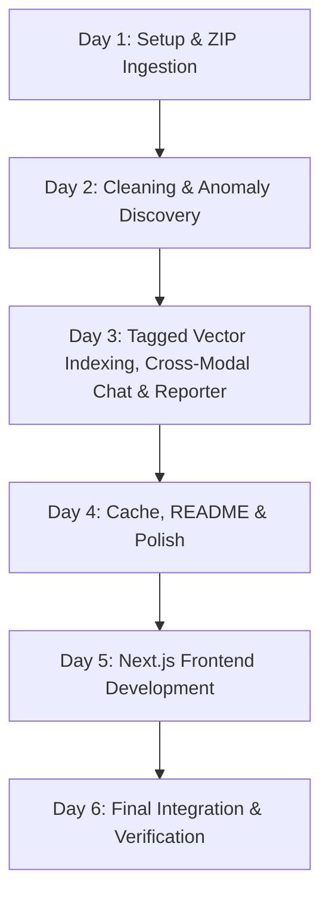

# Meshloop ARCA - Developer Agent Guidelines
## Developer Agent Guidelines & 6-Day Build Plan

This file provides context and instructions for AI agents working on **Meshloop ARCA (Autonomous Root-Cause Analyst)**. Use this as a source of truth for implementation details, architecture, and coding rules.

---

## 🛠️ Architecture & Developer Guidelines

### 1. Technology Stack Compliance
All implementations must align with the hackathon rules requiring the **Microsoft AI stack** and our premium frontend upgrade:
*   **LLM API**: GitHub Models endpoint (`https://models.github.io/inference`) using `gpt-4o` for high-complexity tasks (root-cause discovery, conversational querying) and `microsoft/phi-4` for fast, lightweight tasks (follow-up Q&A suggestions).
*   **Embeddings**: `text-embedding-3-small` via GitHub Models API.
*   **Orchestration**: Semantic Kernel (Python SDK) imports must be present in agent files.
*   **Token Optimization**: A local JSON cache must be used in [llm.py](file:///c:/Coding%20Workspace/OSS-CONTRIBS/meshloop/utils/llm.py) to minimize redundant API calls and rate-limiting.
*   **Backend Server**: FastAPI (Python) exposing REST endpoints on port `8000` with CORS enabled to wrap the core agent pipelines.
*   **Frontend Client**: React Next.js single-page application inside the `frontend/` directory running on port `3000`.

### 2. File Organization
The workspace structure must be organized as follows:
```
meshloop/
├── agents/
│   ├── __init__.py
│   ├── ingestion.py      ← Parses ZIP/multiple files into memory dicts [ingestion.py](file:///c:/Coding%20Workspace/OSS-CONTRIBS/meshloop/agents/ingestion.py)
│   ├── cleaning.py       ← Data cleaning & type normalization [cleaning.py](file:///c:/Coding%20Workspace/OSS-CONTRIBS/meshloop/agents/cleaning.py)
│   ├── discovery.py      ← Statistical checks + LLM-based root causes [discovery.py](file:///c:/Coding%20Workspace/OSS-CONTRIBS/meshloop/agents/discovery.py)
│   ├── chat.py           ← Multi-turn Incident Q&A using vector context [chat.py](file:///c:/Coding%20Workspace/OSS-CONTRIBS/meshloop/agents/chat.py)
│   └── reporter.py       ← Forensic reports + chart configurations [reporter.py](file:///c:/Coding%20Workspace/OSS-CONTRIBS/meshloop/agents/reporter.py)
├── utils/
│   ├── __init__.py
│   ├── llm.py            ← GitHub Models connection + local cache [llm.py](file:///c:/Coding%20Workspace/OSS-CONTRIBS/meshloop/utils/llm.py)
│   ├── sk_kernel.py      ← Semantic Kernel connectors setup [sk_kernel.py](file:///c:/Coding%20Workspace/OSS-CONTRIBS/meshloop/utils/sk_kernel.py)
│   └── vector_store.py   ← In-memory ChromaDB vector store [vector_store.py](file:///c:/Coding%20Workspace/OSS-CONTRIBS/meshloop/utils/vector_store.py)
├── frontend/             ← Next.js React frontend
│   ├── src/
│   │   └── app/
│   │       ├── globals.css  ← Global premium styling & variables [globals.css](file:///c:/Coding%20Workspace/OSS-CONTRIBS/meshloop/frontend/src/app/globals.css)
│   │       ├── layout.js    ← App layout & metadata configuration [layout.js](file:///c:/Coding%20Workspace/OSS-CONTRIBS/meshloop/frontend/src/app/layout.js)
│   │       └── page.js      ← Premium single-page interactive dashboard [page.js](file:///c:/Coding%20Workspace/OSS-CONTRIBS/meshloop/frontend/src/app/page.js)
│   ├── package.json
│   └── README.md
├── sample_data/          ← Test datasets (messy sales CSV + server reports PDF)
├── main.py               ← FastAPI backend REST server [main.py](file:///c:/Coding%20Workspace/OSS-CONTRIBS/meshloop/main.py)
├── pipeline.py           ← Master orchestrator (chains agents) [pipeline.py](file:///c:/Coding%20Workspace/OSS-CONTRIBS/meshloop/pipeline.py)
├── requirements.txt      ← Core Python dependencies [requirements.txt](file:///c:/Coding%20Workspace/OSS-CONTRIBS/meshloop/requirements.txt)
├── .env                  ← Local environment secrets (GITHUB_TOKEN)
├── .gitignore            ← Ignore cache, database, and env files
└── agent.md              ← This instruction & build plan file [agent.md](file:///c:/Coding%20Workspace/OSS-CONTRIBS/meshloop/agent.md)
```

### 3. Coding Guidelines

#### Backend (Python & FastAPI)
*   **API Calls**: Never instantiate the `OpenAI` client directly in agent code. Always use `utils.llm.call_llm()`, `utils.llm.call_llm_json()`, or `utils.llm.get_embedding()`.
*   **Type Hinting**: All python functions must use type hinting for input parameters and return values.
*   **Multi-Modal Serialization**: Store structured `pd.DataFrame` fields in memory and index them alongside text chunks in ChromaDB, utilizing matching `date` and `region` metadata tags to align database events with document narratives.
*   **Error Handling**: Wrap external library calls (e.g. `fitz` for PDF parsing, `json.load`, `pd.read_excel`) in robust try-except blocks and fall back gracefully.

#### Frontend (Next.js React & CSS)
*   **Client Directives**: Add `"use client";` at the top of client-side files like [page.js](file:///c:/Coding%20Workspace/OSS-CONTRIBS/meshloop/frontend/src/app/page.js) to manage component-level states, user interactions, and fetch operations.
*   **API Requests**: Use the native `fetch()` browser API or equivalent methods targeting `http://localhost:8000` to interact with backend endpoints (`/api/analyze`, `/api/chat`, etc.).
*   **Visual Styling**: Write Vanilla CSS declarations inside [globals.css](file:///c:/Coding%20Workspace/OSS-CONTRIBS/meshloop/frontend/src/app/globals.css) to build a cohesive design system using dark mode styles, custom typography (Plus Jakarta Sans/Inter), card layout grids, glowing gradients, hover scaling micro-animations, and custom scrolling behaviors. Avoid Tailwind unless explicitly requested.

---

## 📅 Refined 6-Day Build Plan



### Day 1: Setup, GitHub Models & Ingestion (Manas - Backend)
*   **M1.1 — Folder Structure**: Create python stubs, `/frontend` folder, and setup environment files.
*   **M1.2 — Configuration**: Set up dependencies, `.env` GITHUB_TOKEN, and `test_connection.py`.
*   **M1.3 — LLM Utility (`utils/llm.py`)**: Implement `call_llm` and `get_embedding` with local JSON disk caching.
*   **M1.4 — Ingestion Agent (`agents/ingestion.py`)**: Implement `ingest_file(file_path)` supporting `.zip` archives containing CSVs, Excel, PDFs, JSON, and text logs. Returns separate structured `dataframes` and unstructured `corpora`.

### Day 2: Semantic Kernel, Cleaning & Anomaly Discovery (Manas - Backend)
*   **M2.1 — Semantic Kernel Setup (`utils/sk_kernel.py`)**: Configure Semantic Kernel chat completions using the GitHub Models endpoint.
*   **M2.2 — Cleaning Agent (`agents/cleaning.py`)**: Cleans structured columns and strips unstructured whitespaces.
*   **M2.3 — Pattern Discovery Agent (`agents/discovery.py`)**:
    *   Perform statistical anomaly detection (outliers, conversion drops >30%, trend shifts).
    *   Query ChromaDB for unstructured paragraphs matching the anomaly date or region tags.
    *   Ask GPT-4o to evaluate the relationship and output the synthesized "Root-Cause Anomaly Insight."

### Day 3: Tagged Vector Indexing, Cross-Modal Chat, Reporter & Pipeline (Manas - Backend)
*   **M3.1 — Vector Store (`utils/vector_store.py`)**: Implement `store_dataset(ingestion, cleaned, session_id)` in ChromaDB. Tag tabular row summaries and log paragraphs with matching metadata (`{"date": "...", "region": "...", "type": "..."}`).
*   **M3.2 — Chat Agent (`agents/chat.py`)**: Query ChromaDB for context matching the user's question, and output a styled response citing sources (e.g. `[server_log.pdf]`).
*   **M3.3 — Reporter Agent (`agents/reporter.py`)**: Generates a markdown "Forensic Audit Report" explaining the anomalies and root causes.
*   **M3.4 — Master Pipeline (`pipeline.py`)**: Chains the full 5-step ARCA flow.

### Day 4: README, Cache & FastAPI backend REST Wrapper (Manas & Priya)
*   **M4.1 — README.md**: Document the ARCA project narrative, data-fusion architecture, and Microsoft Stack.
*   **M4.2 — Cache & Rate Limits**: Polish persistent local caches in `utils/llm.py`.
*   **P1.1 — Next.js Setup**: Install and bootstrap the Next.js framework in `/frontend`, verifying compilation.
*   **M4.3 — FastAPI REST endpoints (`main.py`)**: Expose the pipeline `/api/analyze`, Q&A `/api/chat`, and data exports endpoints.

### Day 5: Next.js Frontend Dashboard Features (Priya - Frontend)
*   **P5.1 — Globals & Dark Theme CSS**: Establish custom dark styles in `globals.css` with glowing cards.
*   **P5.2 — Upload Page & Progress Ingesting**: Implement drag-and-drop zip file uploader in `page.js` targeting the backend upload endpoint with reactive progress metrics.
*   **P5.3 — Discovery Insights Tab**: Loop and render critical, high, and medium severity anomaly cards with data evidence.
*   **P5.4 — Visual Analytics Tab**: Render data analytics graphs using premium CSS/SVG custom shapes matching the color themes.

### Day 6: Q&A Chat Room, Exports & Compilation Verification (Priya - Frontend)
*   **P6.1 — Incident Room Chat**: Implement Q&A thread-based window utilizing chat endpoints with badge citations and interactive prompt suggestion chips.
*   **P6.2 — Forensic Reports & Exports**: Build the Markdown report viewer and active download actions to stream cleaned and balanced files from `/api/export/cleaned` and `/api/export/balanced`.
*   **P6.3 — Production Build Verification**: Run `npm run build` in `/frontend` to verify clean compilation with zero warnings or errors. Ensure correct layouts, scroll limits, and responsive widths.
*(Note: Pitch deck slides and demo recording tasks are explicitly omitted per project directives).*
