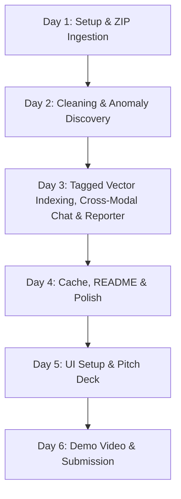

# Meshloop ARCA - Developer Agent Guidelines
## Developer Agent Guidelines & 6-Day Build Plan

This file provides context and instructions for AI agents working on **Meshloop ARCA (Autonomous Root-Cause Analyst)**. Use this as a source of truth for implementation details, architecture, and coding rules.

---

## 🛠️ Architecture & Developer Guidelines

### 1. Technology Stack Compliance
All implementations must align with the hackathon rules requiring the **Microsoft AI stack**:
*   **LLM API**: GitHub Models endpoint (`https://models.github.ai/inference`) using `gpt-4o` for high-complexity tasks (root-cause discovery, conversational querying) and `microsoft/phi-4` for simple/cheap tasks (summarization, follow-up generation).
*   **Embeddings**: `text-embedding-3-small` via GitHub Models API.
*   **Orchestration**: Semantic Kernel (Python SDK) imports must be present in agent files.
*   **Token Optimization**: Since GitHub Models has rate limits, a local cache must be used in `utils/llm.py` for all completions.

### 2. File Organization
The workspace structure must be organized as follows:
```
meshloop/
├── agents/
│   ├── __init__.py
│   ├── ingestion.py      ← Parses multiple files/ZIPs into dataframes & text corpora
│   ├── cleaning.py       ← Data cleaning & type normalization
│   ├── discovery.py      ← Statistical checks + LLM-based root-cause explanations
│   ├── chat.py           ← Multi-turn Incident Room Q&A with RAG citations
│   └── reporter.py       ← Markdown forensic reports + chart configurations
├── utils/
│   ├── __init__.py
│   ├── llm.py            ← GitHub Models connection + local cache
│   └── vector_store.py   ← In-memory ChromaDB vector store with metadata tagging
├── sample_data/          ← Test datasets (messy sales CSV + server reports PDF)
├── app.py                ← Streamlit UI (Priya's frontend)
├── pipeline.py           ← Master orchestrator (chains agents)
├── requirements.txt      ← Core Python dependencies
├── .env                  ← Local environment secrets (GITHUB_TOKEN)
├── .gitignore            ← Ignore cache, database, and env files
└── agent.md              ← This instruction & build plan file
```

### 3. Coding Guidelines
*   **API Calls**: Never instantiate the `OpenAI` client directly in agent code. Always use `utils.llm.call_llm()`, `utils.llm.call_llm_json()`, or `utils.llm.get_embedding()`.
*   **Type Hinting**: All python functions must use type hinting for input parameters and return values.
*   **Multi-Modal Serialization**: Store structured `pd.DataFrame` fields in memory and index them alongside text chunks in ChromaDB, utilizing matching `date` and `region` metadata tags to align database events with document narratives.
*   **Error Handling**: Wrap external library calls (e.g. `fitz` for PDF parsing, `json.load`, `pd.read_excel`) in robust try-except blocks and fall back gracefully.

---

## 📅 Refined 6-Day Build Plan



### Day 1: Setup, GitHub Models & Ingestion (Manas - Backend)
*   **M1.1 — Folder Structure**: Create the directories `agents/`, `utils/`, `sample_data/` and all empty python stubs.
*   **M1.2 — Configuration**: Set up dependencies, `.env` GITHUB_TOKEN, and `test_connection.py`.
*   **M1.3 — LLM Utility (`utils/llm.py`)**: Implement `call_llm` and `get_embedding` with local JSON disk caching.
*   **M1.4 — Ingestion Agent (`agents/ingestion.py`)**: Implement `ingest_file(file_path)` supporting `.zip` archives containing CSVs, Excel, PDFs, JSON, and text logs. Returns separate structured `dataframes` and unstructured `corpora`.

### Day 2: Semantic Kernel, Cleaning & Anomaly Discovery (Manas - Backend)
*   **M2.1 — Semantic Kernel Setup (`utils/sk_kernel.py`)**: Configure Semantic Kernel chat completions using the GitHub Models endpoint.
*   **M2.2 — Cleaning Agent (`agents/cleaning.py`)**: Cleans structured columns and strips unstructured whitespaces.
*   **M2.3 — Pattern Discovery Agent (`agents/discovery.py`)**:
    *   Perform statistical anomaly detection (outliers, conversion drops >30%, trend shifts).
    *   Query ChromaDB for unstructured paragraphs matching the anomaly date or region tags.
    *   Ask GPT-4o to evaluate the relationship and output the synthesized "Root-Cause Anomaly Insight."

### Day 3: Tagged Vector Indexing, Cross-Modal Chat, Reporter & Pipeline (Manas - Backend)
*   **M3.1 — Vector Store (`utils/vector_store.py`)**: Implement `store_dataset(ingestion, cleaned, session_id)` in ChromaDB. Tag tabular row summaries and log paragraphs with matching metadata (`{"date": "...", "region": "...", "type": "..."}`).
*   **M3.2 — Chat Agent (`agents/chat.py`)**: Query ChromaDB for context matching the user's question, and output a styled response citing sources (e.g. `[server_log.pdf]`).
*   **M3.3 — Reporter Agent (`agents/reporter.py`)**: Generates a markdown "Forensic Audit Report" explaining the anomalies and root causes.
*   **M3.4 — Master Pipeline (`pipeline.py`)**: Chains the full 5-step ARCA flow.

### Day 4: README, Cache & Polish (Manas - Backend)
*   **M4.1 — README.md**: Document the ARCA project narrative, data-fusion architecture, and Microsoft Stack.
*   **M4.2 — Cache & Rate Limits**: Polish persistent local caches in `utils/llm.py`.

### Day 5: App UI Setup, Testing & Pitch Deck (Manas & Priya)
*   **P1.1 to P2.2 — Streamlit Frontend (`app.py`)**:
    *   Tab 1: `🔍 Root-Cause Discoveries` (visually distinct cards displaying anomalies, matching log paragraphs, and financial impacts).
    *   Tab 2: `📊 Visual Analytics` (Plotly charts).
    *   Tab 3: `💬 Incident Room Chat` (multi-turn conversation citing sources).
    *   Tab 4: `📋 Audit Report` (markdown report viewer and exporter).
*   **P5.1 — Pitch Deck**: Export 10-slide PowerPoint/Google Slides explaining the operational value of ARCA.

### Day 6: Demo Video & Submission (Manas & Priya)
*   **P6.1 — Demo Recording**: Record a 3-minute video showing ZIP uploading, the progress bars, Root-Cause cards, Visual analytics, live Q&A in the Incident Room, and reports.
*   **P6.2 — Submission**: Verify public repository and links.
